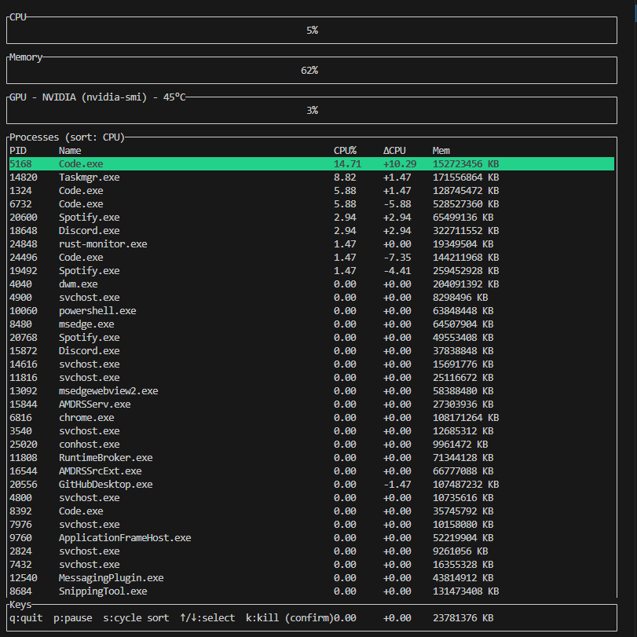

# rust-monitor


Minimal Rust TUI system monitor using `ratatui` and `sysinfo`.

Quick start
-----------

Prerequisites:

- Rust toolchain (stable)

Build:

```sh
cargo build --release
```

Run:

```sh
cargo run --release -- -n myprocess
```

CLI flags:

- `-n, --process <NAME>` — filter processes by name (case-insensitive substring)
- `-p, --pid <PID>` — show only the given PID
- `-i, --interval <MS>` — refresh interval in milliseconds (default: 1000)

GPU support
-----------

- Optional NVIDIA NVML support: `cargo run --features nvml --release`
- On Windows the app falls back to `nvidia-smi` or PowerShell counters when NVML is not enabled.

Screenshot
----------



Notes
-----

- The codebase is modularized into `src/ui.rs`, `src/metrics.rs`, and `src/gpu.rs`.
- Run `cargo test` to execute unit tests for parsing helpers.
- CI is configured in `.github/workflows/ci.yml` to run `cargo fmt`, `cargo clippy`, and `cargo test`.
